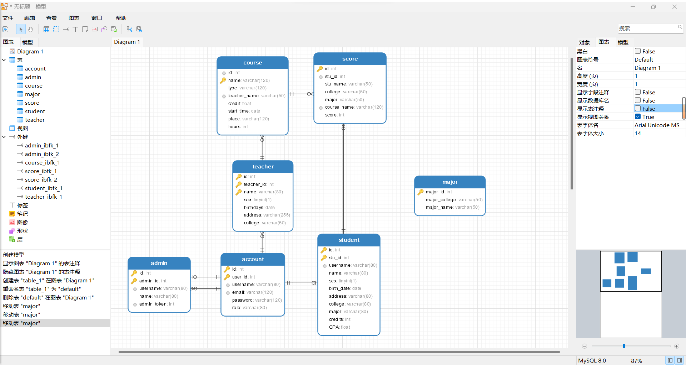

# student_score

## 学生成绩管理系统
### UI： Element plus UI
### 前端 ： Vue cli3 + Vue-router + Vuex + axios + Chart.js
### 后端 ： python Flask
### 数据库： MySQL

## 仓库管理
- front-end 分支 前端代码
- back- end 分支 后端代码

## 前端 Vue Project setup
### 安装依赖，运行项目
```
npm install
```

### Compiles and hot-reloads for development
```
npm run serve
```

### Compiles and minifies for production
```
npm run build
```

### Lints and fixes files
```
npm run lint
```
### 前端目录树
```
│  App.vue
|
│  main.js
│
├─assets    // 静态资源
│  ├─css
│  │      base.css      // 基础样式
│  │      header_nav.css    // 头部导航栏样式
│  │
│  ├─img
│  │      background.jpg     // 背景图片
│  │      index_nav.png     // 首页导航栏图片
│  │      logo.png      // logo图片
│  │
│  ├─js
│  │      InformMsg.js  // 信息提示框
│  │
│  └─lib        // 第三方库
│      └─iconfont       // 阿里字体图标库
│              iconfont.css
│              iconfont.ttf
│
├─components    // 组件
│  ├─common    // 公共组件文件夹
│  │      ChartBox.vue   // 图表组件
│  │      FormInputBox.vue  
│  │      TableBox.vue      // 表格组件
│  │
│  ├─header_nav      // 头部导航栏文件夹
│  │      HeaderNav.vue     // 头部导航栏组件
│  │      UserInfo.vue  
│  │
│  ├─login  // 登录页面文件夹
│  │      LoginBox.vue
│  │
│  ├─main_content    // 内容框文件夹
│  │  │  IndexContent.vue
│  │  │  TabBox.vue     // 标签组件
│  │  │
│  │  ├─admin   // 管理员文件夹
│  │  │      AccountManage.vue      // 账号管理
│  │  │      AdminProfile.vue       // 个人信息
│  │  │      AdminUpdatePwd.vue     // 修改密码
│  │  │      CourseManage.vue       // 课程管理
│  │  │      DataShow.vue       // 表格组件封装，数据展示
│  │  │      MajorManage.vue        // 专业管理
│  │  │      StudentManage.vue      // 学生管理
│  │  │      TeacherManage.vue      // 教师管理
│  │  │
│  │  ├─home    // 首页文件夹
│  │  │      HomeContent.vue
│  │  │
│  │  ├─profile   // 个人信息文件夹，未封装
│  │  │      ProfileInfo.vue
│  │  │      UpdatePsd.vue
│  │  │
│  │  ├─student     // 学生端文件夹
│  │  │      ScoreManager.vue
│  │  │      StuProfile.vue
│  │  │      UpdatePwd.vue
│  │  │
│  │  └─teacher    // 教师端文件夹
│  │          CountScore.vue
│  │          TeaCourseManage.vue
│  │          TeaProfile.vue
│  │          TeaUpdatePwd.vue
│  │
│  └─side_nav       // 侧边导航栏文件夹
│          AsideList.vue
│          AsideOpenalMenu.vue   // 侧边可打开菜单组件
│          AsideStaticMenu.vue
│
├─network       // 网络请求
│      admin.js     // 管理员请求    
│      log_reg.js       // 登录注册请求
│      request.js       // axios封装
│      student.js       // 学生请求
│      teacher.js       // 教师请求
│
├─router        // 路由
│  │  index.js      // 路由配置
│  │
│  └─aside      // 侧边菜单对应的路由
│          admin.js
│          student.js
│          teacher.js
│
├─store     // vuex状态管理
│      index.js
│   
└─views     // 页面
        AdminView.vue
        LoginView.vue
        StudentView.vue
        TeacherView.vue

```
## 后端目录树
```
│  app.py   # 后端主程序
│  settings.py   # 后端配置文件
├─apps  
│  │  model.py   # 数据库模型创建
│  │  utils.py   # 工具函数
│  │  __init__.py   # flask初始化
│  │
│  ├─account    # 账户模块
│  │  │  model.py   # 账户模型创建
│  │  │  view.py    # 账户视图函数
│  │  │  __init__.py    # 账户蓝图注册
│  │  │
│  ├─admin  # 管理员模块
│  │  │  model.py   # 管理员模型创建
│  │  │  view.py    # 管理员视图函数
│  │  │  __init__.py    # 管理员蓝图注册
│  │  │
│  ├─course   # 课程模块
│  │  │  model.py   # 课程模型创建
│  │  │  view.py    # 课程视图函数
│  │  │  __init__.py    # 课程蓝图注册
│  │
│  ├─major  # 专业模块
│  │  │  model.py   # 专业模型创建
│  │  │  view.py    # 专业视图函数
│  │  │  __init__.py    # 专业蓝图注册
│  │
│  ├─score  # 成绩模块
│  │  │  model.py   # 成绩模型创建
│  │  │  view.py    # 成绩视图函数
│  │  │  __init__.py    # 成绩蓝图注册
│  │
│  ├─student    # 学生模块
│  │  │  model.py   # 学生模型创建
│  │  │  view.py    # 学生视图函数
│  │  │  __init__.py    # 学生蓝图注册
│  │
│  ├─teacher    # 教师模块
│  │  │  model.py   # 教师模型创建
│  │  │  view.py    # 教师视图函数
│  │  │  __init__.py    # 教师蓝图注册
│
├─static    # 静态文件
├─templates   # 模板文件

```
## 数据库设计

